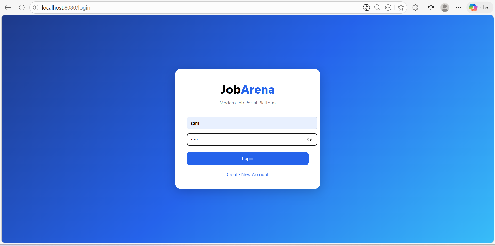
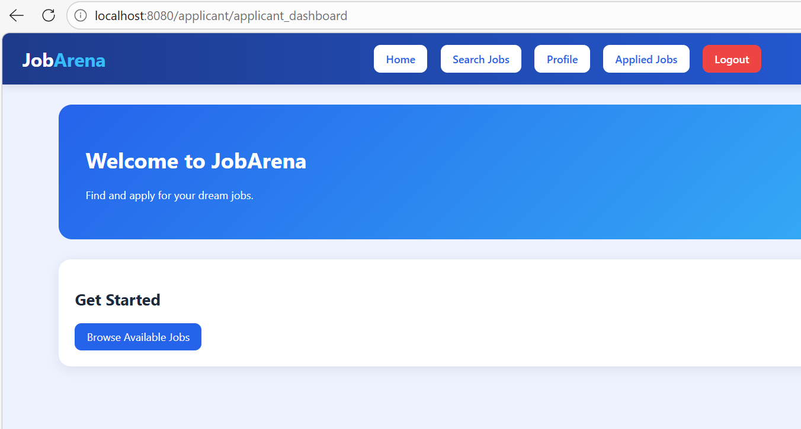
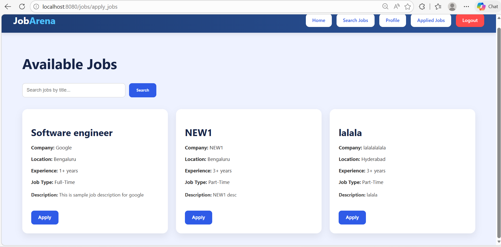
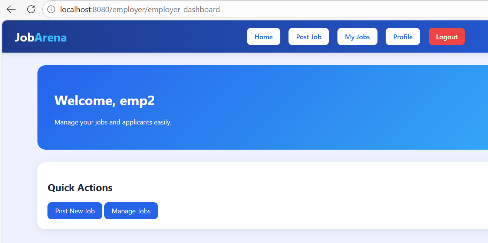
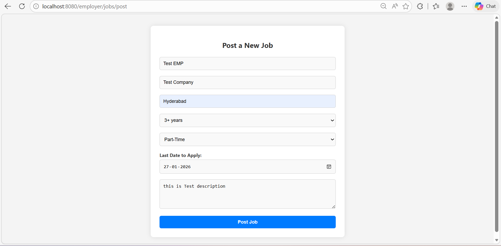
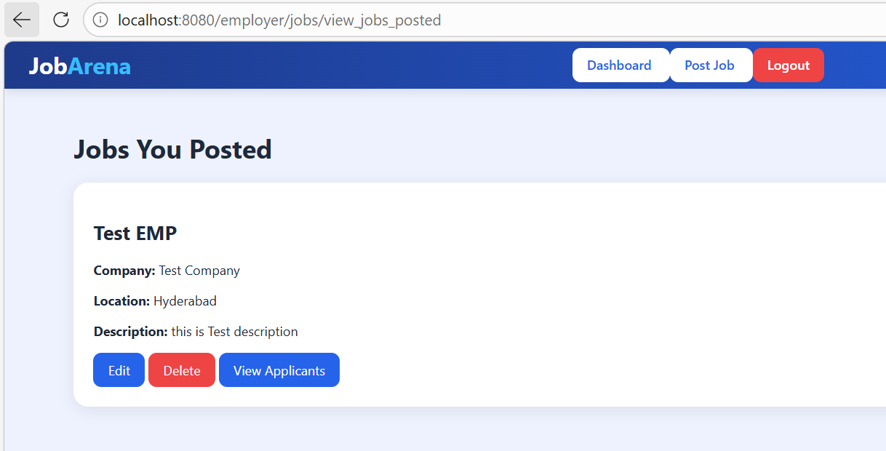

# 🚀 JobArena - Full Stack Job Portal Web Application

JobArena is a modern Full Stack Job Portal application built using **Spring Boot**, **Spring Security**, **Thymeleaf**, and **MySQL**.

The platform allows:

- Employers to post and manage jobs
- Applicants to search and apply for jobs
- Employers to review applications
- Applicants to track application status
- Secure authentication using role-based login

---

# ✨ Features

## 👨‍💼 Employer Features

- Employer Registration & Login
- Post New Jobs
- Edit Existing Jobs
- Delete Jobs
- View Posted Jobs
- View Applicants
- Accept / Reject Applications

---

## 👨‍🎓 Applicant Features

- Applicant Registration & Login
- Search Jobs
- Apply for Jobs
- Track Applied Jobs
- View Application Status
- Profile Management

---

# 📸 Application Screenshots

---

## 🔐 Applicant Login



Secure login page for applicants with modern UI design and authentication.

---

## 👨‍🎓 Applicant Dashboard



Applicant dashboard with navigation menu, profile access, and job search options.

---

## 💼 Apply Jobs Page



Applicants can browse available jobs and apply directly from the portal.

---

## 🔎 Search Feature


Dynamic job search functionality using job title filtering.

---

## 🔐 Employer Login


Employer authentication page with secure login functionality.

---

## 👨‍💼 Employer Dashboard



Employer dashboard for managing posted jobs and applications.

---

## ➕ Job Posting



Employers can create and publish new job openings.

---

## 📋 View Posted Jobs



Employers can edit, delete, and manage all posted jobs.

---


# 🔐 Authentication & Security

- Spring Security Authentication
- Role-Based Authorization
- BCrypt Password Encryption
- Secure Login System
- Session-Based Authentication

---

# 🛠️ Tech Stack

## Backend

- Java 21
- Spring Boot
- Spring MVC
- Spring Security
- Spring Data JPA
- Hibernate

---

## Frontend

- HTML5
- CSS3
- Thymeleaf

---

## Database

- MySQL

---

## Build Tool

- Maven

---

# 📂 Project Structure

```bash
src
 └── main
     ├── java
     │    └── com.jobportal.app
     │         ├── controller
     │         ├── model
     │         ├── repository
     │         ├── service
     │         └── config
     │
     └── resources
          ├── static
          │     ├── css
          │     └── images
          │
          └── templates

---

# ⚙️ Installation & Setup

## 1️⃣ Clone Repository

```bash
git clone https://github.com/YOUR_USERNAME/JobArena-Job-Portal.git
```

---

## 2️⃣ Open Project

Open the project using:

- VS Code
- IntelliJ IDEA
- Eclipse

---

## 3️⃣ Create MySQL Database

```sql
CREATE DATABASE jobportal;
```

---

## 4️⃣ Configure application.properties

Open:

```bash
src/main/resources/application.properties
```

Update:

```properties
spring.datasource.url=jdbc:mysql://localhost:3306/jobportal
spring.datasource.username=root
spring.datasource.password=YOUR_PASSWORD
```

---

## 5️⃣ Install Dependencies

```bash
mvn clean install
```

---

## 6️⃣ Run Application

```bash
mvn spring-boot:run
```

---

# 🌐 Application URL

```bash
http://localhost:8080
```

---

# 🔑 Demo Roles

## 👨‍💼 Employer

Can:

- Post Jobs
- Manage Jobs
- View Applicants
- Update Application Status

---

## 👨‍🎓 Applicant

Can:

- Search Jobs
- Apply for Jobs
- Track Applications

---

# 📌 Core Functionalities

✔ User Authentication
✔ Role-Based Access
✔ CRUD Operations
✔ Job Management
✔ Application Tracking
✔ Employer Dashboard
✔ Applicant Dashboard
✔ Search Functionality
✔ Responsive UI Design

---

# 🚀 Future Improvements


- Email Notifications
- Admin Dashboard
- JWT Authentication
- REST API Version
- Resume Upload
- React Frontend
- Docker Deployment
- Cloud Hosting (AWS / Render)

---

# 📚 Learning Outcomes

This project helped in understanding:

- Spring Boot Architecture
- MVC Design Pattern
- Authentication & Authorization
- Database Relationships
- Full Stack Development
- CRUD Operations
- Secure Web Development

---

# 👨‍💻 Author

Developed by **Sahil**

---

# ⭐ Support

If you like this project, consider giving it a ⭐ on GitHub.

---

# 📄 License

This project is developed for educational and portfolio purposes.
